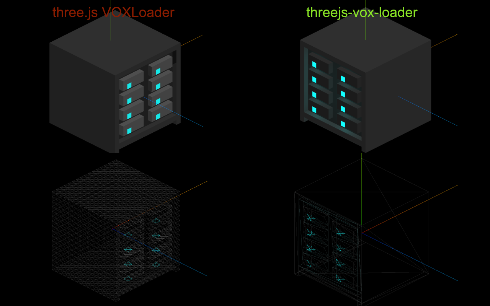

# threejs-vox-loader

A [Three.js](https://threejs.org/) loader for `.vox` files (from MagicaVoxel), designed for realistic rendering and correct voxel scene orientation.



## Features

* 🔧 **Optimized Meshes** – Builds efficient geometry for faster rendering and lower memory usage.
* 🌐 **PBR Materials** – Automatically applies `roughness` and `metalness` values from the `.vox` file for realistic surfaces.
* 💡 **Emissive Voxels with Lighting** – Converts emissive voxels into real-time `PointLight`s for dynamic scene illumination.
* 🎯 **Accurate Orientation** – Ensures models are correctly aligned in the Three.js coordinate system.
* 🧩 **Easy Integration** – Minimal setup required; simply load and add to your Three.js scene.
* 🏗️ **Multi-Object Scene Support** – Fully supports MagicaVoxel scenes composed of multiple models.
* 🧊 **Glass & Transparency Support** – Handles transparent voxels with proper material rendering.

## Installation

```bash
npm install threejs-vox-loader
```

## Usage

```javascript
import { VOXLoader } from 'threejs-vox-loader';

const loader = new VOXLoader();
loader.load('path/to/model.vox', function (voxScene) {
    scene.add(voxScene);
});
```