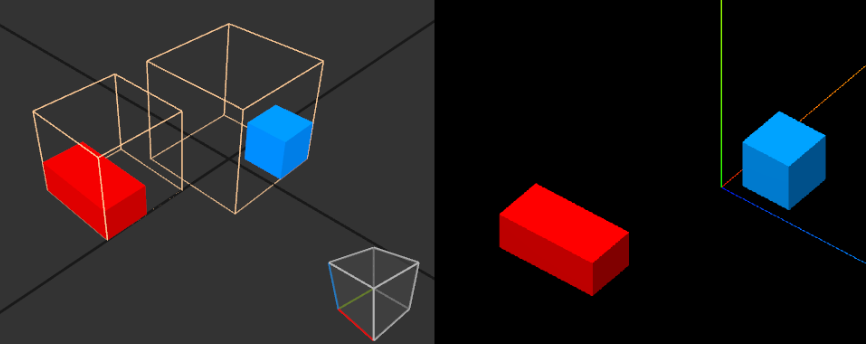
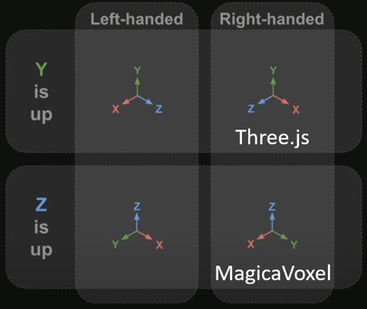

# threejs-vox-loader

A [Three.js](https://threejs.org/) loader for `.vox` files (from MagicaVoxel), designed for realistic rendering and correct voxel scene orientation.


## Features

* 🔧 **Optimized Meshes** – Builds efficient geometry for faster rendering and lower memory usage.
* 🌐 **PBR Materials** – Automatically applies `roughness` and `metalness` values from the `.vox` file for realistic surfaces.
* 💡 **Emissive Voxels with Lighting** – Converts emissive voxels into real-time `PointLight`s for dynamic scene illumination.
* 🎯 **Accurate Orientation and Positioning** – Ensures models are correctly aligned in the Three.js coordinate system.
* 🧩 **Easy Integration** – Minimal setup required; simply load and add to your Three.js scene.
* 🏗️ **Multi-Object Scene Support** – Fully supports MagicaVoxel scenes composed of multiple models.
* 🧊 **Glass & Transparency Support** – Handles transparent voxels with proper material rendering.

### Positioning

The objects of a MagicaVoxel scene are anchored around their center and have a position in the scene relativ to the origin.
The loader outputs a VoxScene object which is a three.js Group anchored around the origin in the MagicaVoxel scene.



By default a newly created MagicaVoxel project is a 40 x 40 x 40 cube with the position x 0 y 0 z 20 which means the cube is placed "ontop" of the origin (the center of the bottom face is at the origin, it is the anchor of the object).

If you want the scene to be anchored at its center, call `voxScene.center()`

### Coordinate-System

MagicaVoxel and Three.js use different coordinate-systems:



The loader automatically converts to the threejs coordinate system.

## Installation

npm [threejs-vox-loader](https://www.npmjs.com/package/threejs-vox-loader)

```bash
npm install threejs-vox-loader
```

## Usage

```javascript
import { VOXLoader } from 'threejs-vox-loader';

const loader = new VOXLoader();
loader.load('path/to/model.vox', function (voxScene) {
    scene.add(voxScene);
});
```

## Options

Be aware that the material properties like roughness or metalness of MagicaVoxel behave differently in three.js

```javascript
new VOXLoader({
    defaultMaterialOptions: {
        flatShading: true,
        roughness: 0,
        metalness: 0
    },
    enableMetalness: true,
    enableRoughness: true,
    enableGlass: true,
    enableEmissive: true,
    lightIntensity: 10,
    lightDistance: 3,
    lightDecay: 2,
    useRectLights: false
});
```

| Property                             | Type    | Default Value                                       | Description                                                     |
|--------------------------------------|---------|-----------------------------------------------------|-----------------------------------------------------------------|
| `defaultMaterialOptions`             | Object  | `{ flatShading: true, roughness: 0, metalness: 0 }` | Default material settings for rendering.                        |
| `defaultMaterialOptions.flatShading` | Boolean | `true`                                              | Enables flat shading.                                           |
| `defaultMaterialOptions.roughness`   | Number  | `0`                                                 | Sets the surface roughness (0 = smooth, 1 = rough).             |
| `defaultMaterialOptions.metalness`   | Number  | `0`                                                 | Sets the surface metalness (0 = non-metal, 1 = fully metallic). |
| `enableMetalness`                    | Boolean | `true`                                              | Allows control over metalness property in materials.            |
| `enableRoughness`                    | Boolean | `true`                                              | Allows control over roughness property in materials.            |
| `enableGlass`                        | Boolean | `true`                                              | Enables glass-like material effects.                            |
| `enableEmissive`                     | Boolean | `true`                                              | Enables emissive (self-illuminating) material properties.       |
| `lightIntensity`                     | Number  | `10`                                                | Intensity of the scene's light source.                          |
| `lightDistance`                      | Number  | `3`                                                 | Distance at which the light has effect.                         |
| `lightDecay`                         | Number  | `2`                                                 | Light decay rate over distance.                                 |
| `useRectLights`                      | Boolean | `false`                                             | Use RectLights, see three.js docs                               |
